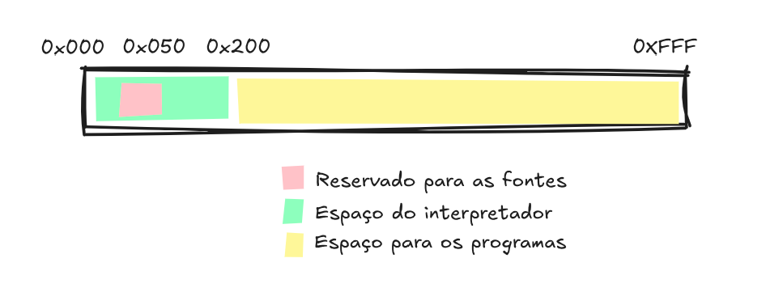
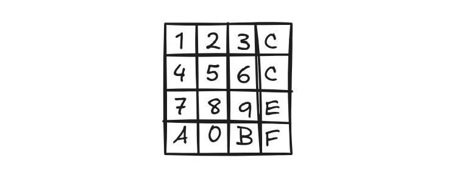
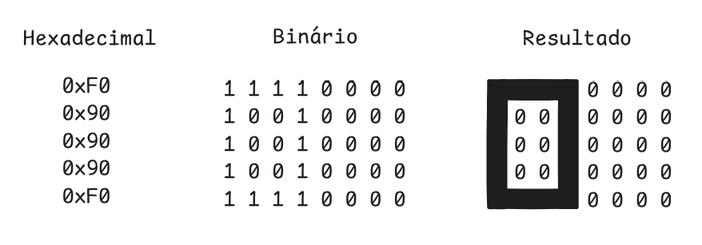

# Entendendo a Arquitetura
Agora que já entemos o que foi o CHIP-8, podemos adentrar às especificações técnicas deste sistema. São elas:

| Componente | Descrição              |
|------------|------------------------|
| Memória    | 4 KB (4096 bytes)      |
| CPU        | 36 instruções          |
| Teclado         | Teclado com 16 teclas  |
| Display    | 64x32 Monocromático    |

## 1) Memória 

A arquitetura do CHIP-8 possui 4 KB (4096 bytes) de memória RAM, que é compartilhada por diferentes componentes. Para entender melhor como ela funciona, é útil visualizar como esse espaço de 4 KB é dividido.

A memória é organizada da seguinte forma:

    

- **0x000 - 0x1FF (0 a 511)** : Esta área é reservada para o interpretador do CHIP-8. Geralmente, é aqui que ficam armazenados os dados essenciais para o funcionamento do sistema, como o conjunto de fontes (font set).
    - **0x050 - 0x09F (80 a 159)**: Dentro da área reservada, há um espaço dedicado para os sprites de fonte do próprio sistema. 

        Qualquer local dentro dos primeiros 512 bytes (`0x000-0x1FF`) é aceitável. Por convenção, é comum armazenar as fontes no endereço `0x050-0x09F`.
- **0x200 - 0xFFF (512 a 4095)**: Este é o espaço principal para os programas (ROMS) e os dados que eles utilizam. A maioria dos jogos e programas começa a ser carregada a partir do endereço `0x200`.

É importante notar que alguns programas mais antigos, podiam começar a ser carregados a partir do endereço `0x60`, mas o padrão é esse que foi citado.

## 2) CPU

## 3) Teclado

O teclado original do CHIP-8 não se parece com um teclado de computador moderno. Em vez disso, ele é um teclado hexadecimal com 16 teclas em uma grade de 4x4, que vão de 0 a F.

    

## 4) Display
O display é monocromático, com resolução de 32x64 pixels (sim, preto e branco). Isso significa que cada pixel pode estar apenas ligado ou desligado.

Para escrever o número 0 no CHIP-8, a abordagem é simples: desenhamos o caractere ativando os pixels (definindo o bit como 1) nas posições em que ele deve "aparecer". Por exemplo:

    

Os sprites de texto possuem o tamanho 8x5 pixels. 