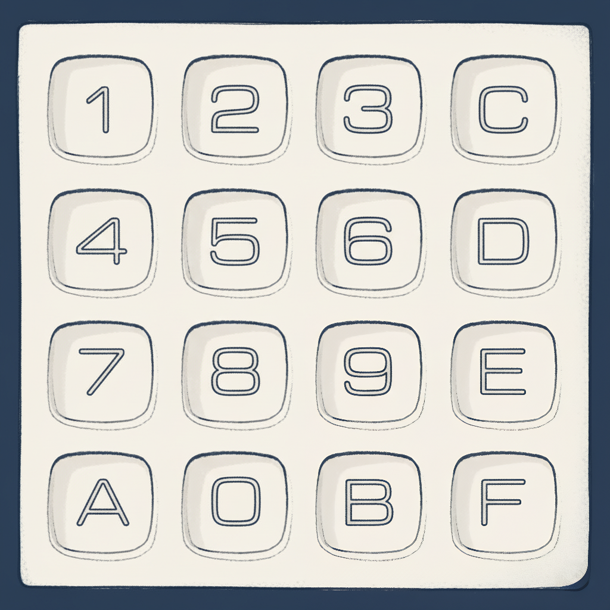

# Entendendo a Arquitetura
Agora que já entemos o que foi o CHIP-8, podemos adentrar às especificações técnicas deste sistema. São elas:

| Componente | Descrição              |
|------------|------------------------|
| Memória    | 4 KB (4096 bytes)      |
| CPU        | 36 instruções          |
| Teclado         | Teclado com 16 teclas  |
| Display    | 64x32 Monocromático    |

## 1) Memória 

A arquitetura do CHIP-8 possui 4 KB (4096 bytes) de memória RAM, que é compartilhada por diferentes componentes. Para entender melhor como ela funciona, é útil visualizar como esse espaço de 4 KB é dividido.

A memória é organizada da seguinte forma:

    

- **0x000 - 0x1FF (0 a 511)** : Esta área é reservada para o interpretador do CHIP-8. Geralmente, é aqui que ficam armazenados os dados essenciais para o funcionamento do sistema, como o conjunto de fontes (font set).
    - **0x050 - 0x09F (80 a 159)**: Dentro da área reservada, há um espaço dedicado para os sprites de fonte do próprio sistema. 

        Qualquer local dentro dos primeiros 512 bytes (`0x000-0x1FF`) é aceitável. Por convenção, é comum armazenar as fontes no endereço `0x050-0x09F`.
- **0x200 - 0xFFF (512 a 4095)**: Este é o espaço principal para os programas (ROMS) e os dados que eles utilizam. A maioria dos jogos e programas começa a ser carregada a partir do endereço `0x200`.

É importante notar que alguns programas mais antigos, podiam começar a ser carregados a partir do endereço `0x60`, mas o padrão é esse que foi citado.

## 2) CPU

A CPU do CHIP-8 é bastante simples e otimizada para o sistema, consistindo em uma série de componentes principais:

| Componente | Descrição |
| :--- | :--- |
| **Registradores de Propósito Geral (V)** | 16 registradores de propósito geral de 8 bits |
| **Registrador de Índice (I)** | Registrador de índice de 16 bits |
| **Pilha** | Pilha capaz de armazenar até 16 valores de 16 bits |
| **Ponteiro da Pilha (SP - Stack Pointer)** | Um registrador que aponta para o topo da pilha |
| **Contador de Programa (PC - Program Counter)** | Registrador de 16 bits para armazenar a localização atual do interpretador na memória |
| **Temporizador de Atraso (DT - Delay Timer)** | Um temporizador que conta de 0 para baixo a uma taxa de 60 Hz |
| **Temporizador de Som (ST - Sound Timer)** | Um temporizador que conta de 0 para baixo a uma taxa de 60 Hz; se este temporizador for > 0, então um som será reproduzido |
| **Instruções** | 36 opcodes de 16 bits |

> O fato dos registradores deste sistema possuirem 8 bits é o que levou ao "8" no nome CHIP-8

Agora vamos adentrar um pouco em alguns detalhes de cada componente...

### Registradores (V0 até VF)

Os registradores de propósito geral de uma CPU, geralmente chamados de Vx, são responsáveis por armazenar valores numéricos de 8 bits para operações e comparações. O CHIP-8 possui 16 desses registradores, numerados de V0 a VF (de 0 a 15 em hexadecimal).

O registrador VF tem um papel especial, atuando como um sinalizador para certas instruções, como um sinalizador para operações de adição (indicando overflow), subtração (indicando "empréstimo") e desenho (indicando colisão de pixels).

Devido à sua função como sinalizador, o VF não deve ser utilizado como um registrador de propósito geral comum para evitar interferências nessas operações.

---

- Além dos registradores de propósito geral, a CPU do CHIP-8 conta com um registrador especial de 16 bits, o `I`, usado exclusivamente para armazenar endereços de memória.
- Para o controle de tempo, o sistema possui dois registradores de 8 bits que agem como temporizadores: o `delay timer` e o `sound timer`, ambos decrementando a uma taxa de 60 Hz.
    > O Chip-8 pode reproduzir apenas um som, e a frequencia ("tonalidade") dele é decidida pelo dono do interpretador.

Por fim, o fluxo de execução do programa é gerenciado pelo `PC (Program Counter)`, um registrador de 16 bits que guarda o endereço da instrução a ser executada, e o `SP (Stack Pointer)`, que aponta para o endereço atual no topo da pilha de memória.

---
### Instruções (Opcodes)
Um opcode é o código que indica à CPU qual operação deve ser executada, como desenhar, somar ou mover dados. No Chip-8, cada instrução tem 2 bytes (16 bits) e é dividida em partes:

    

O primeiro nibble (4 bits) representa a instrução em si, ou seja, o opcode, que define qual operação será executada. O segundo nibble normalmente indica o registrador Vx, o terceiro nibble pode indicar outro registrador Vy e o quarto nibble pode ser usado como um valor pequeno (N).

Em alguns casos, os dois últimos nibbles juntos formam um valor imediato de 8 bits (KK), e em outros, os três últimos nibbles juntos formam um endereço de 12 bits (NNN).

Por exemplo, a instrução 6A0F significa carregar o valor 0x0F (15 em decimal) no registrador VA, já que o 6 indica a operação de carregar, o A indica o registrador alvo e o 0F é o valor imediato.

Para entender melhor, vamos ver o que significa cada instrução:

| **Instrução** | **Operação** | **Descrição** |
|---------------|--------------|---------------|
| 00E0 | Clear Screen | Coloca todos os pixels da tela em 0 (limpa a tela). |
| 00EE | pc = stack[sp]; sp = sp - 1 | Define o contador de programa para o endereço no topo da pilha e decrementa o ponteiro da pilha. |
| 1nnn | pc = nnn | Coloca em PC o valor NNN (salta para o endereço NNN). |
| 2nnn | sp += 1; stack[sp] = pc; pc = nnn | Incrementa o stack pointer, salva o PC atual na pilha e define o PC como NNN (chamada de sub-rotina). |
| 3xkk | Se Vx == kk, pc += 2 | Pula a próxima instrução se o valor do registrador Vx for igual a KK. |
| 4xkk | Se Vx ≠ kk, pc += 2 | Pula a próxima instrução se o valor do registrador Vx for diferente de KK. |
| 5xy0 | Se Vx == Vy, pc += 2 | Pula a próxima instrução se o valor de Vx for igual a Vy. |
| 6xkk | Vx = kk | Define o valor do registrador Vx para KK. |
| 7xkk | Vx += kk | Soma KK ao valor de Vx. |
| Annn | I = nnn | Define o registrador I para o valor NNN. |
| Bnnn | pc = nnn + V0 | Salta para o endereço NNN somado a V0. |
| 8xy0 | Vx = Vy | Copia o valor de Vy para Vx. |
| 8xy1 | Vx = Vx OR Vy | Faz o OU lógico entre Vx e Vy e guarda em Vx. |
| 8xy2 | Vx = Vx AND Vy | Faz o E lógico entre Vx e Vy e guarda em Vx. |
| 8xy3 | Vx = Vx XOR Vy | Faz o XOR lógico entre Vx e Vy e guarda em Vx. |
| 8xy4 | Vx = Vx + Vy; VF = carry | Soma Vy a Vx. VF = 1 se houver overflow, senão 0. |
| 8xy5 | Vx = Vx - Vy; VF = !borrow | Subtrai Vy de Vx. VF = 0 se ocorrer underflow, senão 1. |
| 8xy6 | Vx = Vy >> 1; VF = LSB | Desloca Vy um bit para a direita e guarda em Vx. VF recebe o bit menos significativo antes do deslocamento. |
| 8xy7 | Vx = Vy - Vx; VF = !borrow | Define Vx como Vy - Vx. VF = 0 se ocorrer underflow, senão 1. |
| 8xyE | Vx = Vy << 1; VF = MSB | Desloca Vy um bit para a esquerda e guarda em Vx. VF recebe o bit mais significativo antes do deslocamento. |
| 9xy0 | Se Vx ≠ Vy, pc += 2 | Pula a próxima instrução se Vx for diferente de Vy. |
| Dxyn | Desenha sprite | Desenha um sprite na tela de 8 pixels de largura e N de altura na posição (Vx, Vy). Pixels são XORados. VF = colisão. |
| Fx1E | I += Vx | Soma o valor de Vx ao registrador I. |
| Fx29 | I = sprite_addr[Vx] | Define I como o endereço do sprite hexadecimal representando o dígito em Vx. |
| Fx33 | BCD(Vx) → memory[I..I+2] | Converte Vx em BCD e armazena os dígitos nos endereços I, I+1 e I+2. |
| Fx55 | memory[I..I+X] = V0..Vx | Armazena os valores dos registradores V0 até Vx na memória começando em I. |
| Fx65 | V0..Vx = memory[I..I+X] | Carrega nos registradores V0 até Vx os valores da memória a partir de I. |

## 3) Teclado

O teclado original do CHIP-8 não se parece com um teclado de computador moderno. Em vez disso, ele é um teclado hexadecimal com 16 teclas em uma grade de 4x4, que vão de 0 a F.

    

## 4) Display
O display é monocromático, com resolução de 32x64 pixels (sim, preto e branco). Isso significa que cada pixel pode estar apenas ligado ou desligado.

Para escrever o número 0 no CHIP-8, a abordagem é simples: desenhamos o caractere ativando os pixels (definindo o bit como 1) nas posições em que ele deve "aparecer". Por exemplo:

    

Os sprites de texto possuem o tamanho 8x5 pixels. 
