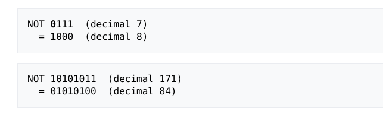
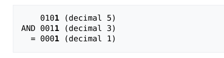
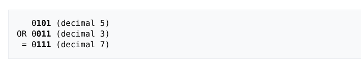
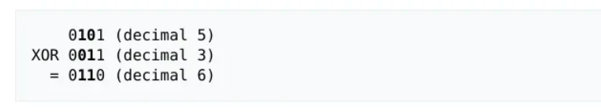

#   Operações Bitwise

Os computadores só entendem 0 e 1, conhecidos como bits (abreviação de binary digits). Cada bit é como um interruptor: 0 significa "desligado" e 1 significa "ligado". Tudo o que usamos em um computador — jogos, músicas, vídeos, textos — é representado como sequências de bits agrupadas em números binários.

Por exemplo, a letra "A" pode ser codificada como `01000001`, e um pixel azul pode ser representado por uma sequência como `00000000 00000000 11111111`. Mas como o computador realiza cálculos com esses 0s e 1s?

Nesse mundo dos bits, temos 3 tipos de operações:

- **Operações Aritméticas:** São as operações matemáticas básicas que os computadores realizam com números binários, como soma, subtração, multiplicação e divisão. Es
- **Operações Lógicas (Bitwise):**   São operações que manipulam diretamente os bits individuais de um número, sem tratá-lo como um valor numérico. 

Neste momento, vamos focar mais nas operações lógicas, pois elas são essenciais para o processo de decodificação de instruções no CHIP-8. Vamos conhecer as principais:

## 1) NOT (~)
A operação NOT inverte todos os bits de um número: cada 0 vira 1, e cada `1` vira `0`.

| A | ~A |
|---|----| 
| 0 | 1  |
| 1 | 0  |

    

## 2) AND (&)
A operação AND compara dois bits e retorna `1` apenas se ambos forem `1`. Caso contrário, retorna `0`.

| A | B | A & B |
|---|---|-------|
| 0 | 0 |   0   |
| 0 | 1 |   0   |
| 1 | 0 |   0   |
| 1 | 1 |   1   |

    

## 3)  OR (|)

A operação OR retorna `1` se pelo menos um dos bits for `1`. Só retorna `0` se ambos forem `0`.

| A | B | A \| B |
|---|---|--------|
| 0 | 0 |   0    |
| 0 | 1 |   1    |
| 1 | 0 |   1    |
| 1 | 1 |   1    |

    

## 4) XOR (^)

A operação XOR retorna `1` se os bits forem diferentes e `0` se forem iguais.

| A | B | A ^ B |
|---|---|-------|
| 0 | 0 |   0   |
| 0 | 1 |   1   |
| 1 | 0 |   1   |
| 1 | 1 |   0   |

    

## 5)  Shift (<< e >>)
As operações de shift deslocam os bits de um número para a esquerda (`<<`) ou direita (`>>`).

### **Shift Left (<<):**
- Desloca bits para a esquerda
- Preenche com 0s à direita
- Equivale a multiplicar por 2^n

### **Shift Right (>>):**
- Desloca bits para a direita  
- Preenche com 0s à esquerda
- Equivale a dividir por 2^n

| Operação | Valor Original | Resultado |
|----------|----------------|-----------|
| 5 << 1   | 101 (binário)  | 1010      |
| 5 << 2   | 101 (binário)  | 10100     |
| 10 >> 1  | 1010 (binário) | 101       |
| 10 >> 2  | 1010 (binário) | 10        |
