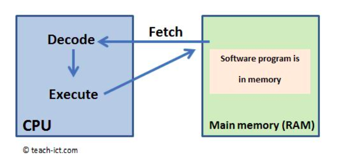

# Loop Fetch, Decode, Execute

<p align="center">
    
</p>

Um emulador basicamente roda sempre o mesmo ciclo, conhecido como fetch-decode-execute loop. Esse ciclo é a espinha dorsal do funcionamento da CPU, e no CHIP-8 não é diferente. Podemos pensar nele como um processo de 3 passos repetidos infinitamente:

### 1) Fetch (buscar instrução)
O Program Counter (PC) aponta para o endereço da memória onde está a próxima instrução.
### 2) Decode (decodificar instrução)
Agora precisamos entender o que a instrução significa. Na prática, isso é feito com um grande `switch/if` ou usando máscaras (bitwise AND) para isolar pedaços da instrução.

### 3) Execute (executar instrução)
Uma vez decodificada, a instrução é executada. Isso pode envolver várias ações, como:

- Carregar valores em registradores
- Desenhar sprites na tela
- Pular para outro endereço

Cada operação muda o estado do emulador, atualizando registradores, memória, timers, tela ou entrada.


# Decodificação de Instruções
Antes de mergulhar na decodificação das instruções, vale a pena entender por que o bitwise (operações em nível de bit) é tão importante nesse processo. Para isso, clique [AQUI](./Bitwise.md). Também há alguns conceitos que serão necessários para entender todo o processo:

---
- [O que é Nibble? | Mude de Mundo](https://mudedemundo.com.br/glossario/o-que-e-nibble/)
- [Entendendo o Sistema Hexadecimal: Uma Explicação Completa | GrowthCode](https://growthcode.com.br/en/sistemas-de-numeracao/entendendo-o-sistema-hexadecimal-uma-explicacao-completa/)
---

Agora que você já possui uma boa base, podemos de fato entrar na tradução de intruções!

## Traduzindo uma Instrução

Como exemplo, vamos utilizar a instrução `0x1A33`. Lembremos que uma instrução do CHIP-8 é 16 bits, então isso significa que cada dígito do número é um nibble (4 bits):


| Valor em Hexadecimal| Valor em Decimal | Valor em Binário (Nibble) |
|----------------|---------------------- | ------------------------  |
| **1**        | 1        |      0001
| **A**        | 10       |      1010
| **3**        | 3          |    0011
| **3**        | 3          |    0011

> As intruções vêm em hexadecimal para facilitar a representação, já que cada nibble pode ser representado por um único dígito, facilitando a visualização. O `0x` no começo significa que o número está em hexadecimal, portanto não faz parte do valor do número.

Agora vamos começar a "tradução". Ela é separada em basicamente 2 partes:

- **PRIMERO NIBBLE:** Define qual a operação realizada pela instrução.

- **TODO O RESTO:** Operandos para a instrução.

Para isolarmos as partes, usaremos as famosas operações Bitwise, pois permitem que possamos manipular partes específicas do valor. Por exemplo, podemos isolar o primeiro nibble da instrução fazendo um AND/&& com o valor `0xF000`.

Esse valor em binário, é:

```
1111 0000 0000 0000
```
Quando fazemos AND entre uma instrução e `0xF000`, isso "filtra" o número:


- Onde a máscara tem 1, ela mantém o bit original da instrução.
- Onde a máscara tem 0, ela zera o bit da instrução.

Isso significa que, fazendo o AND com esse valor, vamos manter só o primeiro nibble, ou seja, exatamente o que sinaliza qual é a instrução:

```
0001 1010 0011 0011  (0x1A33)
AND
1111 0000 0000 0000  (0xF000)
--------------------
0001 0000 0000 0000  (0x1000)
```
É fazendo esse isolamento que conseguimos definir o que cada instrução vai fazer. Na prática, nosso código será algo como:

```
tipo_instrucao = instrucao && 0xF000

if(tipo_instrucao == 0x1000){
    [...]
} else if (tipo_instrucao == 0x2000){
    [...]
}
```
> É apenas um exemplo. Logicamente, vamos organizar isso de uma forma melhor. Abaixo há a lista de todas as intruções do CHIP-8.

# Lista total de Instruções


| **Instrução** | **Operação** | **Descrição** |
|---------------|--------------|---------------|
| 00E0 | Clear Screen | Coloca todos os pixels da tela em 0 (limpa a tela). |
| 00EE | pc = stack[sp]; sp = sp - 1 | Define o contador de programa para o endereço no topo da pilha e decrementa o ponteiro da pilha. |
| 1nnn | pc = nnn | Coloca em PC o valor NNN (salta para o endereço NNN). |
| 2nnn | sp += 1; stack[sp] = pc; pc = nnn | Incrementa o stack pointer, salva o PC atual na pilha e define o PC como NNN (chamada de sub-rotina). |
| 3xkk | Se Vx == kk, pc += 2 | Pula a próxima instrução se o valor do registrador Vx for igual a KK. |
| 4xkk | Se Vx ≠ kk, pc += 2 | Pula a próxima instrução se o valor do registrador Vx for diferente de KK. |
| 5xy0 | Se Vx == Vy, pc += 2 | Pula a próxima instrução se o valor de Vx for igual a Vy. |
| 6xkk | Vx = kk | Define o valor do registrador Vx para KK. |
| 7xkk | Vx += kk | Soma KK ao valor de Vx. |
| Annn | I = nnn | Define o registrador I para o valor NNN. |
| Bnnn | pc = nnn + V0 | Salta para o endereço NNN somado a V0. |
| 8xy0 | Vx = Vy | Copia o valor de Vy para Vx. |
| 8xy1 | Vx = Vx OR Vy | Faz o OU lógico entre Vx e Vy e guarda em Vx. |
| 8xy2 | Vx = Vx AND Vy | Faz o E lógico entre Vx e Vy e guarda em Vx. |
| 8xy3 | Vx = Vx XOR Vy | Faz o XOR lógico entre Vx e Vy e guarda em Vx. |
| 8xy4 | Vx = Vx + Vy; VF = carry | Soma Vy a Vx. VF = 1 se houver overflow, senão 0. |
| 8xy5 | Vx = Vx - Vy; VF = !borrow | Subtrai Vy de Vx. VF = 0 se ocorrer underflow, senão 1. |
| 8xy6 | Vx = Vy >> 1; VF = LSB | Desloca Vy um bit para a direita e guarda em Vx. VF recebe o bit menos significativo antes do deslocamento. |
| 8xy7 | Vx = Vy - Vx; VF = !borrow | Define Vx como Vy - Vx. VF = 0 se ocorrer underflow, senão 1. |
| 8xyE | Vx = Vy << 1; VF = MSB | Desloca Vy um bit para a esquerda e guarda em Vx. VF recebe o bit mais significativo antes do deslocamento. |
| 9xy0 | Se Vx ≠ Vy, pc += 2 | Pula a próxima instrução se Vx for diferente de Vy. |
| Dxyn | Desenha sprite | Desenha um sprite na tela de 8 pixels de largura e N de altura na posição (Vx, Vy). Pixels são XORados. VF = colisão. |
| Fx1E | I += Vx | Soma o valor de Vx ao registrador I. |
| Fx29 | I = sprite_addr[Vx] | Define I como o endereço do sprite hexadecimal representando o dígito em Vx. |
| Fx33 | BCD(Vx) → memory[I..I+2] | Converte Vx em BCD e armazena os dígitos nos endereços I, I+1 e I+2. |
| Fx55 | memory[I..I+X] = V0..Vx | Armazena os valores dos registradores V0 até Vx na memória começando em I. |
| Fx65 | V0..Vx = memory[I..I+X] | Carrega nos registradores V0 até Vx os valores da memória a partir de I. |
