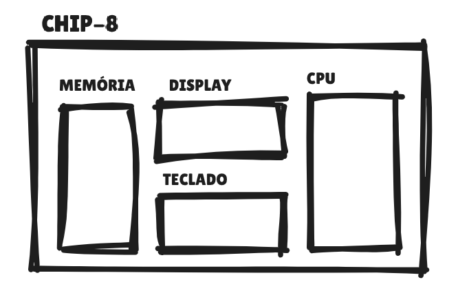

Com a arquitetura do emulador definida, o próximo passo é entender como o código começa a ganhar vida — ou seja, como cada parte vai sendo construída e passa a se comunicar com as outras. Tudo começa com um arquivo principal, onde o emulador realmente “acorda”. A ideia inicial é simples: criar um ambiente onde possamos juntar todos os elementos do sistema e coordenar a execução. O CHIP-8 pode ser dividido em 4 componentes principais, e cada um tem uma função bem específica dentro da engrenagem:

1) **CPU:** É ela que vai ler as instruções dos jogos, entender o que precisam fazer e executar essas ações
2) **Memória:** O local onde as informações ficam guardadas — tanto o código do jogo quanto os dados temporários usados pela CPU
3) **Display:** Ele é o “rosto” do emulador, exibindo os gráficos em uma tela simples de 64x32 pixels
4) **Teclado:** O meio pelo qual o jogador interage com o sistema

    

Vamos começar primeiro pelas partes independentes, ou seja, aquelas que não dependem de outros componentes para funcionar corretamente. Isso facilita o desenvolvimento, porque podemos testar e entender cada módulo separadamente antes de conectá-los.

> Por exemplo, pense na CPU: ela é o cérebro do sistema, responsável por executar as instruções. No entanto, para fazer isso, ela precisa que o programa já esteja armazenado na memória — afinal, é de lá que as instruções são lidas. **Isso significa que não podemos começar pela CPU, já que ela depende diretamente da memória para funcionar.**

Assim, o ideal é iniciar pelos módulos mais simples e autônomos, como a **memória** e o **display**. A memória pode ser criada de forma isolada, pois seu papel é apenas guardar e fornecer dados quando solicitada. O display também pode ser implementado à parte, já que ele apenas desenha pixels na tela com base nas informações que receberá mais tarde. Podemos ver esses passos abaixo:

### [3.1) Memória](./3-1-memoria/memoria.md)
### [3.2) Display](./3-2-display/display.md)